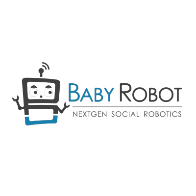
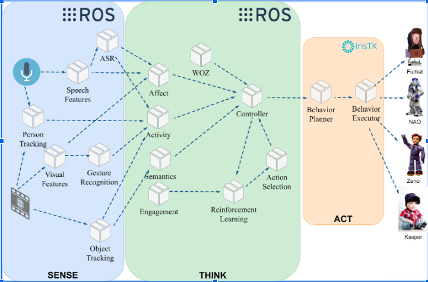
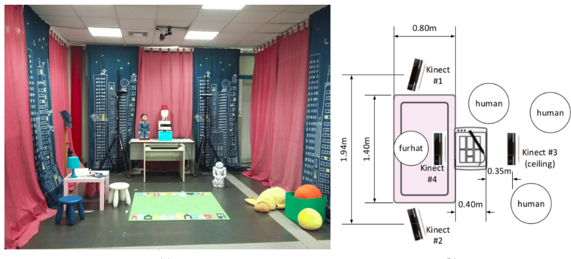

# BabyRobot core modules



These are the modules that are used in the use cases 1 and 2 of the [Baby Robot EU Project, grant number: 687831](http://babyrobot.eu/).


## Integrated Services

- Audio Stream
  - A raw audio stream as captured by the front facing Kinect or the mic. 
  - Outputs a byte64 encoded wav audio segment.
  - Dummy segmentation by timing (e.g. publish a new message every 10 seconds).
- Color Stream
  - A color image stream as captured by the front facing Kinect.
  - Outputs byte64 encoded image frames.
- Depth Stream
  - A depth image stream as captured by the front facing Kinect.
  - Outputs byte64 depth frames.
- Object Recognition Module
  - A stream of the detected objects in the current image.
  - Outputs the bounding box an the label for every detected object along with the frame id.
  - Optionally subscribes to the depth stream and outputs the proximity for each object. 
- ASR Module
  - A stream of the transcribed text for an audio segment.
  - Outputs the text transcription along with the audio segment id.
- Emotion Recognition Module
  - A stream of emotions extracted from the visual and the audio modality. 
    The emotion prediction is the combined prediction of the 2 modalities.
  - Outputs a list of predicted emotions
- Speech Features Module
  - A stream of low level audio features (MFCCs, fMMLR, i-vectors, functionals)
  - Uses OpenSmile or Kaldi to extract features from raw audio segment
  - Outputs the predicted features along with the audio segment id.
- Kinect2StreamsRecorder
  - Recording of all Kinect V2 Streams at 30 fps.
- Gesture and Action Recognition Module
  - The Gesture Recognition module is responsible for recognizing the gestures and actions that are performed by children both in real time as well as in offline tasks. 
-  Distant speech recognition module 
    - The Distant Speech Recognition module is employed for real time and continuous recognition of children’s speech (can also be used in offline tasks).
- AudioVisual Diarization module
  - The audiovisual diarization module receives input from the speaker localization module and the kinect API in order to increase both the accuracy of localization as well as achieve speaker diarization. 
- Speaker localization module
    - The speaker localization module is used in order to recognize the position/angle of a speaker so that the robot can face him/her while talking. 
- 3D Object Tracking Module
  - The Object Tracking module estimates the 6-DoF poses (positions and orientations) of a number of movable objects that the children are expected to interact with.
- Wizard-of-Oz
  - Wizard of Oz interface for autonomous, semi-autonomous, and manual mode. Allows the system to work in 3 modes: autonomous, semi autonomous and manual.
- Visual Emotion Recognition module 
  - The visual emotion recognition module can be used to recognize the emotion of a child based on its body posture and facial expressions. 
- Engagement Detection Module
  - Visual child engagement estimation.
- Speech-based Emotion recognition
  - The speech based emotion recognition module can be used to recognize the emotion of a child based on its speech. Outputs include discrete emotion, emotion polarity and emotion intensity.
- Text-based emotion recognition
  - Emotion recognition based on the child's speech (text).
- Text-based cognitive state recognition
  - Cognitive state recognition based on the child's speech (text).


The outputs are timestamped for all modules.

## System Architecture



We employ a layered architecture as can be seen in the schematic above. We split the system components in three conceptual layers

- Sense: This layer incorporates components that perform low level processing on audio and visual input and includes functionalities for feature extraction, speech to text conversion, object and person tracking etc.  
- Think: This layer provides higher level outputs for affective state recognition, engagement, reinforcement learning etc. The high level outputs are provided to a controller that performs action selection. A Wizard Of OZ interface is provided for the user to control the action selection directly. Intercomponent communication in the Sense and Think layers is handled by ROS
- Act: This layer processes the selected actions and executes them in the robots using IrisTK. Currently supported robots are Furhat, NAO, Zeno and Kaspar (experimental).

## Hardware Setup

The proposed hardware setup to fully utilized the aforementioned modules, as well as a room where this setup is implemented, is presented in the following Figure.



The setup comprises of four Kinect v2 sensors placed in front, front left, front right and directly above the area where the games are played. Furthermore we utilize a touch screen connected to a Windows machine needed for the various games. The components run in four different PCs on a hybrid setup. One PC is running Windows and IrisTk for real time dialog management. The other PCs run Linux and executes the master and slave ROS nodes. The Kinect sensors are connected and stream the video, depth and audio input in real time.

The hardware requirements for the Linux PCs are
- A recent generation Intel CPU (i5 or higher)
- 16GB RAM
- 1TB of storage
- One recent NVIDIA GPU (GTX1070 or higher)

## API

We provide a REST API to access the outputs of the low level modules. The requests, and responses of the API are described below:

```
POST /v1/recognize/objects: 
INPUT:
    {
        "image": base64_encoded_image
    }
HEADERS: application/json
RESULT:
    {
        json containing recognized objects and bounding boxes
    }

POST /v1/recognize/speechfeatures: 
INPUT:
    {
        "clip": base64_encoded_wav_clip
    }
HEADERS: application/json
RESULT:
    {
        json containing names and values of the extracted speech features
    }

POST /v1/recognize/emotions: 
INPUT:
    {
        "clip": base64_encoded_wav_clip
    }
HEADERS: application/json
RESULT:
    {
        json containing recognized emotion, emotion polarity and intensity
    }

POST /v1/recognize/semanticembeddings: 
INPUT:
    {
        "clip": base64_encoded_wav_clip
    }
HEADERS: application/json
RESULT:
    {
        json containing recognized emotion, emotion polarity and intensity
    }
```
